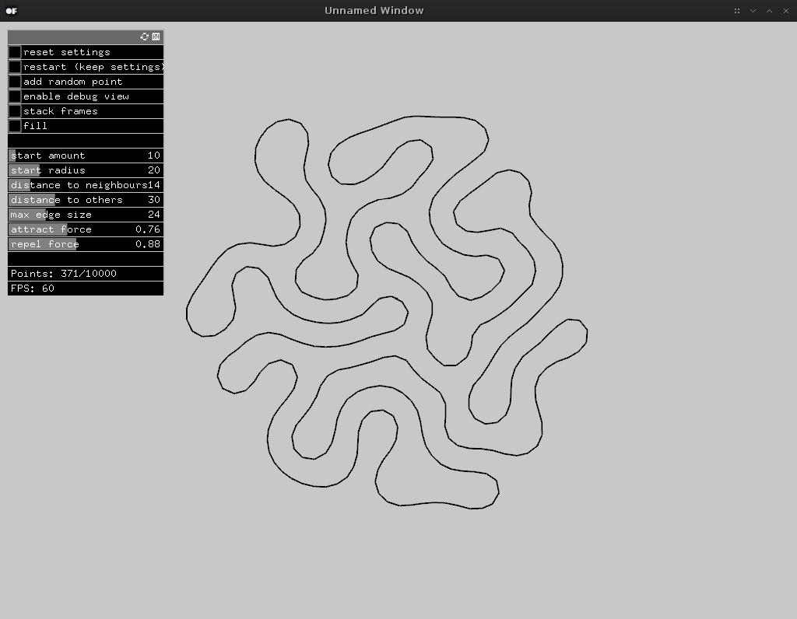

# connectedLine

This openFrameworks project is part of a series of small experiments I made trying to learn more about generative algorithms.
Most of these are based on textual descriptions by Anders Hoff ([Github](https://github.com/inconvergent) / [Twitter](https://twitter.com/inconvergent)). I encourage you to check out his texts on different aspects of generative algorithms. Links can be found at the bottom of [his website](http://inconvergent.net/).

I'm using [ofxNearestNeighbour](https://github.com/neilmendoza/ofxNearestNeighbour) by Neil Mendoza for an amazing speed boost when looking up points within a certain radius.

